  

  
  
  
  
  
  

  
  
  

  <a href="#pt-br">PT-BR</a> •
  <a href="#english">English</a> •
  <a href="#focus-areas--areas-de-foco">Focus Areas</a> •
  <a href="#featured-work--projetos-em-destaque">Featured Work</a> •
  <a href="#support-my-work--apoie-meu-trabalho">Support</a> •
  <a href="#elsewhere--redes">Elsewhere</a> •
  <a href="#contact--contato">Contact</a>

## PT-BR

Sou Bernardo Gomes, desenvolvedor com foco forte em front-end, automação e experiência de produto, atualmente também estudante de Medicina. Gosto de construir software com acabamento real: interfaces polidas, automações úteis, ferramentas Linux nativas e produtos que resolvem problemas concretos.

Meus projetos costumam viver na interseção entre:

- engenharia de front-end com React, TypeScript e arquitetura moderna
- automação aplicada à saúde, produtividade e operação
- ecossistema Linux, hardware, áudio e desktop customization

## English

I am Bernardo Gomes, a frontend-first engineer focused on automation, product experience, and polished execution, while also studying Medicine. Most of my work sits at the intersection of modern web engineering, Linux-native tooling, hardware integration, and healthcare-adjacent products.

I care about software that feels intentional:

- strong UI and performance, not just shipping screens
- automation that saves time in real workflows
- systems that connect product thinking, engineering rigor, and human context

## Focus Areas / Areas de Foco

- Frontend products built with React, TypeScript, Next.js, Vite, and performance-first thinking.
- Automation systems for healthcare, browsers, and operational workflows with Python, APIs, and bots.
- Linux-native tools, audio workflows, hardware integrations, and custom desktop experiences.
- Product-minded engineering shaped by both software practice and medical training.

## Featured Work / Projetos em Destaque

| Project | Why it matters |
| --- | --- |
| [`BeBitter`](https://github.com/bernardopg/BeBitter) | Performance-first portfolio in React and TypeScript, with bilingual UX, strong visual direction, and production-level frontend care. |
| [`doctoralia-scrapper`](https://github.com/bernardopg/doctoralia-scrapper) | End-to-end healthcare workflow automation with scraping, response generation, API endpoints, async jobs, and notifications. |
| [`mvp-estetoscopio`](https://github.com/bernardopg/mvp-estetoscopio) | Study platform centered on spaced repetition, multimedia flashcards, and a modern full-stack learning experience. |
| [`cmmg-calendar`](https://github.com/bernardopg/cmmg-calendar) | Academic schedule converter and analyzer that turns institutional JSON into calendar-ready workflows and usable interfaces. |
| [`arduino-audio-controller`](https://github.com/bernardopg/arduino-audio-controller) | Linux hardware mixer powered by Arduino, Python, GTK4, and LibAdwaita for practical desktop audio control. |
| [`iaruba`](https://github.com/bernardopg/iaruba) | Functional Linux audio tooling with Haskell, GTK, and hardware control, built with a systems-oriented mindset. |

**Also shipping / Também construindo:** [`dms-adguard-vpn-plugin`](https://github.com/bernardopg/dms-adguard-vpn-plugin), [`dolphin-servicemenus`](https://github.com/bernardopg/dolphin-servicemenus), [`mymediaplayer`](https://github.com/bernardopg/mymediaplayer), [`steam-idler-python`](https://github.com/bernardopg/steam-idler-python).

## Support My Work / Apoie Meu Trabalho

If my work is useful to you, sponsoring helps me spend more time building open-source tools, polished frontend products, Linux-native experiments, and automation that solves real workflows.

  

## Elsewhere / Redes

  
  
  
  
  

## Toolbox / Ferramentas

  

  
  
  
  

## Signals / Sinais

  
  

## Contribution Flow / Fluxo de Contribuições

  <picture>
    <source media="(prefers-color-scheme: dark)" srcset="./.github/assets/snake-dark.svg" />
    <source media="(prefers-color-scheme: light)" srcset="./.github/assets/snake.svg" />
    
  </picture>

## Contact / Contato

  
  
  
  
  

  Open to frontend-heavy products, automation-intensive tooling, and technical ideas that need strong execution.

