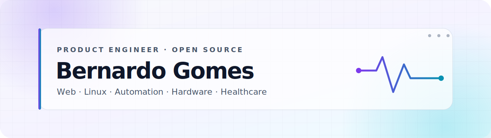

  <picture>
    <source media="(prefers-color-scheme: dark)" srcset="./.github/assets/hero-dark.svg" />
    <source media="(prefers-color-scheme: light)" srcset="./.github/assets/hero-light.svg" />
    
  </picture>

  
  
  
  

  <code>Product Engineering</code> · <code>Frontend Architecture</code> · <code>Linux Desktop</code> · <code>Automation</code> · <code>Healthcare</code>

## Engineering useful software across disciplines

I am a **frontend-first product engineer and medical student** based in Belo Horizonte, Brazil. I design and ship product-grade software where interface quality, systems thinking, and real-world workflows meet—from high-performance web applications to Linux-native tools, browser automation, hardware integrations, and healthcare-adjacent products.

My work favors measurable outcomes: accessible interfaces, explicit architecture, reliable automation, observable integrations, security-aware delivery, and documentation that makes maintenance easier.

  
<strong>Resumo em português</strong>

   
  Sou engenheiro de produto com forte especialização em frontend e estudante de Medicina. Construo aplicações web de alta performance, ferramentas nativas para Linux, automações e integrações de hardware, sempre com atenção a UX, arquitetura, segurança, observabilidade e manutenção de longo prazo.

## What I am building

- **Linux desktop engineering:** QML/Quickshell plugins, telemetry surfaces, hardware controls, PipeWire workflows, and native-feeling desktop integrations.
- **Product frontend:** React and TypeScript applications with design systems, accessibility, performance budgets, SEO, testing, and production delivery.
- **Automation and services:** Python/FastAPI systems, browser automation, API orchestration, asynchronous jobs, notifications, and operational tooling.
- **Healthcare and education:** calendar interoperability, clinical-review workflows, and spaced-repetition products informed by medical training.

## Selected engineering work

| Project | Engineering scope | Core stack |
| --- | --- | --- |
| [**AiOverviewControl**](https://github.com/bernardopg/AiOverviewControl) | Multi-provider AI quota telemetry and provider-health surfaces for DankMaterialShell. | QML, Qt, Quickshell, API integrations |
| [**ioruba**](https://github.com/bernardopg/ioruba) | Arduino-driven desktop audio mixer connecting physical controls to Linux audio. | Tauri 2, React, TypeScript, Rust, serial I/O, PipeWire |
| [**LASCMMG**](https://github.com/bernardopg/LASCMMG) | Real-time tournament platform with authenticated workflows, live updates, and offline-capable UX. | React, Node.js, Express, Socket.IO, Redis, SQLite, PWA |
| [**BeBitter**](https://github.com/bernardopg/BeBitter) | Bilingual portfolio with repository-backed content, performance budgets, secure delivery, and technical SEO. | React 19, TypeScript, Vite 8, Tailwind CSS 4, Vitest, CodeQL |
| [**cmmg-calendar**](https://github.com/bernardopg/cmmg-calendar) | Academic schedule parsing and calendar interoperability for Google Calendar and Apple Calendar. | TypeScript, data parsing, iCalendar/ICS, web automation |
| [**doctoralia-scrapper**](https://github.com/bernardopg/doctoralia-scrapper) | Healthcare review ingestion, response-generation pipeline, API endpoints, and operational notifications. | Python, FastAPI, Selenium, async jobs, Telegram Bot API |

Also shipping: [dms-adguard-vpn-plugin](https://github.com/bernardopg/dms-adguard-vpn-plugin) · [full-upgrade](https://github.com/bernardopg/full-upgrade) · [AutoJoin-for-SteamGifts](https://github.com/bernardopg/AutoJoin-for-SteamGifts) · [mvp-estetoscopio](https://github.com/bernardopg/mvp-estetoscopio)

## Technical toolbox

| Area | Technologies and practices |
| --- | --- |
| **Frontend & product** | React, TypeScript, Vite, Next.js, Tailwind CSS, Radix UI, shadcn/ui, design systems, WCAG, Core Web Vitals |
| **Services & automation** | Python, FastAPI, Flask, Node.js, REST APIs, Selenium, scraping, asynchronous processing, Telegram bots |
| **Linux & systems** | QML, Quickshell, Qt/GTK, Rust, C, Shell, Tauri, PipeWire, systemd, Arch Linux |
| **Hardware & data** | Arduino, serial protocols, SQLite, Redis, iCalendar/ICS, device-to-desktop integrations |
| **Quality & delivery** | GitHub Actions, Docker, Vitest, Testing Library, ESLint, CodeQL, dependency review, Lighthouse, semantic releases |

## Open-source signals

  
  

  <picture>
    <source media="(prefers-color-scheme: dark)" srcset="./.github/assets/snake-dark.svg" />
    <source media="(prefers-color-scheme: light)" srcset="./.github/assets/snake.svg" />
    
  </picture>

## Work with me

I am open to frontend-heavy products, Linux desktop engineering, automation-intensive systems, and cross-disciplinary projects that benefit from strong product judgment and careful execution.

  
  
  

  Building from Belo Horizonte, Brazil · Available in Portuguese and English

