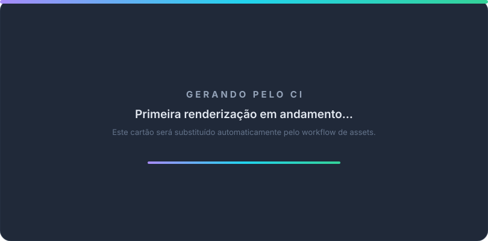
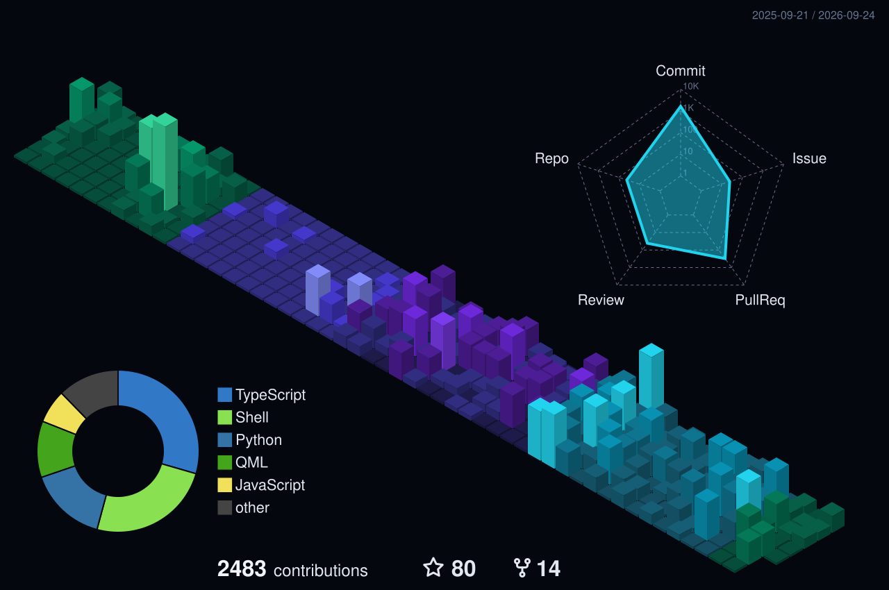

  <picture>
    <source media="(prefers-color-scheme: dark)" srcset="./.github/assets/hero-dark.svg" />
    <source media="(prefers-color-scheme: light)" srcset="./.github/assets/hero-light.svg" />
    
  </picture>

  
  
  
  

  

  <code>Front-end</code> ·
  <code>Full-stack</code> ·
  <code>Linux Desktop</code> ·
  <code>Automação</code> ·
  <code>Saúde</code>

---

## 👋 Sobre

Sou **desenvolvedor**. Gosto da parte em que a ideia vira tela, a tela vira produto e o produto
roda de verdade na máquina de alguém — com performance, acessibilidade e acabamento.

- 🎯 **Front-end em primeiro lugar.** React + TypeScript, design system próprio, WCAG e Core Web Vitals como régua.
- 🧩 **Full-stack quando precisa.** Python/FastAPI, Node, SQLite, Redis — API enxuta para sustentar a interface.
- 🐧 **Linux nativo.** Plugins QML/Quickshell, Wayland, PipeWire, Arch. Ferramenta que eu uso todo dia.
- 🤖 **Automação com propósito.** Scraping, bots e CLIs que eliminam trabalho repetitivo.
- 🩺 **Saúde.** Plataformas de estudo e presença digital para estudantes e profissionais de medicina.
- 🇧🇷 Belo Horizonte, Brasil · pt-BR e inglês técnico.

  
<strong>🔭 No que estou trabalhando agora</strong>

 

- **Scalpel** — consolidando o antigo `cmmg-calendar` e o `mvp-estetoscopio` numa plataforma única.
- **AiOverviewControl** — evoluindo o widget de telemetria de IA para o DankMaterialShell.
- **Ioruba** — mixer de áudio físico com Tauri 2 + Arduino, empacotado para Homebrew e Scoop.

---

## 🚀 Projetos em destaque

### 🩺 Scalpel — plataforma unificada de saúde

> Hub de apps para estudantes e profissionais de medicina: dashboard, login único,
> calendário acadêmico e flashcards com repetição espaçada (SM-2), tudo sob o mesmo domínio.
>
> **O que mudou:** `cmmg-calendar` e `mvp-estetoscopio` foram **descontinuados como repositórios
> isolados** e migraram para o Scalpel. Os repositórios antigos ficam arquivados apenas como histórico.
>
> `Next.js` · `React` · `TypeScript` · `Vite` · `PHP 8.3` · `SQLite` · `monorepo`

 

| Projeto | O que é | Stack |
| :-- | :-- | :-- |
| 🧠 **[AiOverviewControl](https://github.com/bernardopg/AiOverviewControl)** | Painel de consumo e saúde de múltiplos provedores de IA direto na barra do DankMaterialShell. | QML · Quickshell · Qt · APIs REST |
| 🎛️ **[Ioruba](https://github.com/bernardopg/ioruba)** | Mixer de áudio de mesa: hardware Arduino controlando volume por aplicação no Linux. | Tauri 2 · Rust · React · TypeScript · PipeWire |
| 🔄 **[full-upgrade](https://github.com/bernardopg/full-upgrade)** | Orquestrador modular de atualização do Arch: pacman/AUR, Flatpak, Docker, firmware e auditoria. | Shell · Arch Linux · systemd |
| 🛡️ **[dms-adguard-vpn-plugin](https://github.com/bernardopg/dms-adguard-vpn-plugin)** | Controle, configuração e monitoramento do AdGuard VPN sem sair do desktop. | QML · Quickshell · JavaScript |
| 🏆 **[LASCMMG](https://github.com/bernardopg/LASCMMG)** | Gestão de torneios em tempo real com placar ao vivo, autenticação e uso offline. | React · Node.js · Socket.IO · Redis · PWA |
| 🩻 **[doctoralia-scrapper](https://github.com/bernardopg/doctoralia-scrapper)** | Coleta de avaliações, geração de respostas e alertas operacionais para clínicas. | Python · FastAPI · Selenium · Telegram Bot |
| 💼 **[BeBitter](https://github.com/bernardopg/BeBitter)** | Meu portfólio bilíngue: conteúdo versionado, orçamento de performance e SEO técnico. | React 19 · TypeScript · Vite · Tailwind 4 · Vitest |

Também mantenho:
<a href="https://github.com/bernardopg/color-picker-dms">color-picker-dms</a> ·
<a href="https://github.com/bernardopg/wingdrive">wingdrive</a> ·
<a href="https://github.com/bernardopg/AutoJoin-for-SteamGifts">AutoJoin-for-SteamGifts</a> ·
<a href="https://github.com/bernardopg/zshrc-config">zshrc-config</a> ·
<a href="https://github.com/bernardopg/mymediaplayer">mymediaplayer</a>

---

## 🛠️ Caixa de ferramentas

 

 

| Área | Ferramentas e práticas |
| :-- | :-- |
| **Front-end & produto** | React, TypeScript, Vite, Next.js, Tailwind CSS, Radix UI, shadcn/ui, design systems, WCAG, Core Web Vitals |
| **Serviços & automação** | Python, FastAPI, Flask, Node.js, APIs REST, Selenium, scraping, jobs assíncronos, bots de Telegram |
| **Linux & sistemas** | QML, Quickshell, Qt/GTK, Rust, C, Shell, Tauri, PipeWire, Wayland, systemd, Arch Linux |
| **Hardware & dados** | Arduino, protocolos seriais, SQLite, Redis, iCalendar/ICS, integrações device-to-desktop |
| **Qualidade & entrega** | GitHub Actions, Docker, Vitest, Testing Library, ESLint, CodeQL, Dependabot, actions com SHA fixado |

---

## 📊 Sinais de open source

  
  

  
  

  

<picture>
  <source media="(prefers-color-scheme: dark)" srcset="./.github/assets/snake-dark.svg" />
  <source media="(prefers-color-scheme: light)" srcset="./.github/assets/snake.svg" />
  
</picture>

Todos os gráficos acima são gerados por GitHub Actions e commitados neste repositório —
sem serviço externo no carregamento, sem imagem quebrada.
Detalhes em **[docs/PROFILE_SETUP.md](./docs/PROFILE_SETUP.md)**.

---

## 💬 Vamos trabalhar juntos

Aceito projetos **front-end**, **automação** e **produto para saúde** — do protótipo ao deploy.

  
  
  

  Escrevo em <strong>português</strong> e em <strong>inglês técnico</strong> — escolha o que for mais confortável.

